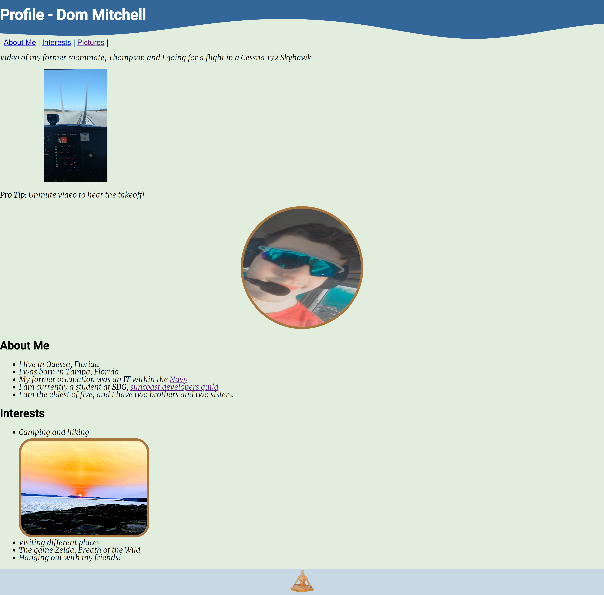

# HelloHTML

## Assignment

The goal of this assignment was to create a basic webpage to display knowledge of html.

The above is a screen capture of the first page from my website.

A link to the webpage that I made can be found in the About section of this repository or below.

https://helloprofile-dommitchell.netlify.app/
